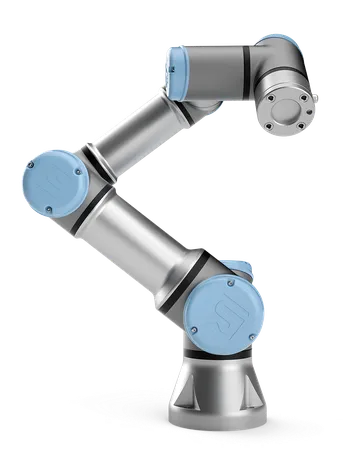

# UR3e Digital Twin Case Study

Welcome to the UR3e Case Study for the **Engineering Digital Twins** course at Aarhus University.

- [UR3e Digital Twin Case Study](#ur3e-digital-twin-case-study)
  - [Introduction to the UR3e](#introduction-to-the-ur3e)
  - [Repository Structure](#repository-structure)
  - [Getting Started](#getting-started)
  - [Dependencies](#dependencies)
  - [Contributing](#contributing)

This repository contains the codebase and examples required to build and interact with a Digital Twin of a Universal Robots UR3e robotic arm. The project allows you to run a virtual mockup of the robot, interact with it via RabbitMQ, and develop your own digital twin components.

## Introduction to the UR3e

The [Universal Robots UR3e](https://www.universal-robots.com/products/ur3e/) is a collaborative robotic arm designed for light industrial applications. It features six degrees of freedom, a payload capacity of 3 kg, and a reach of 500 mm. The UR3e is widely used in research and industry due to its versatility, ease of programming, and safety features.


In this case study, you will simulate the UR3e robot using a simplified mockup that communicates via RabbitMQ. You will learn how to control the robot, receive state updates, and build your own digital twin functionalities.

## Repository Structure

The repository is organized as follows:

- **`0_pre_requisites/`**: Contains instructions and notebooks for setting up your development environment. **Start here.**
- **`communication/`**: Contains the protocol definitions and RabbitMQ handling code used to exchange messages between the mockup and your digital twin.
- **`examples/`**: A series of Jupyter Notebooks demonstrating how to run, control, and configure the mockup.
- **`startup/`**: Python scripts and configurations required to launch the UR3e mockup services.
- **`ur3e_mockup/`**: The internal logic for the robot simulation.

## Getting Started

To get started with this case study, please follow these steps strictly in order:

1. **Environment Setup**: Navigate to `0_pre_requisites/` and complete the `0_environment_setup.ipynb` notebook. This ensures you have Python 3.11, Poetry, Docker, and RabbitMQ installed and configured correctly.
2. **Running the Mockup**: Follow the instructions in `examples/0_running_the_mockup.ipynb` to spin up the robot simulation.
3. **Interacting with the Robot**: Proceed through the remaining notebooks in the `examples/` folder to learn how to send control commands and receive state updates.

## Dependencies

This project is managed using [Poetry](https://python-poetry.org/). To install the dependencies, run the following in the project root, preferably in a virtual environment:

```bash
poetry install
```

## Contributing

Contributions are welcome! If you find any issues or have suggestions for improvements, please open an issue or submit a pull request.
